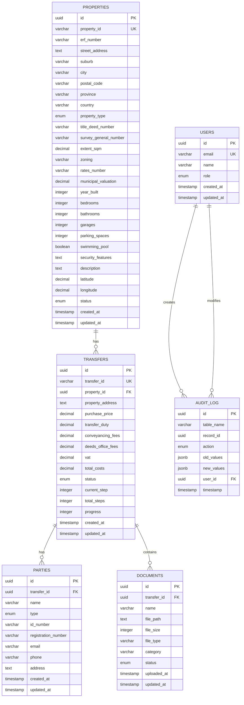

# Legitify ConveyHub - Mermaid ERD

## Entity Relationship Diagram (Mermaid)

## Relationship Types

### One-to-Many Relationships
- **USERS** to **AUDIT_LOG**: One user can create many audit entries
- **PROPERTIES** to **TRANSFERS**: One property can have many transfers
- **TRANSFERS** to **PARTIES**: One transfer can have many parties
- **TRANSFERS** to **DOCUMENTS**: One transfer can have many documents

### Cascade Delete Rules
- Deleting a TRANSFER deletes associated PARTIES and DOCUMENTS
- Deleting a PROPERTY sets TRANSFER.property_id to NULL (preserves history)
- AUDIT_LOG entries are preserved for compliance

## Enum Values

### User Roles
- `admin` - System administrator
- `user` - Regular user
- `conveyancer` - Legal practitioner

### Property Types
- `residential` - Residential property
- `commercial` - Commercial property
- `industrial` - Industrial property
- `agricultural` - Agricultural land
- `vacant_land` - Vacant land

### Property Status
- `active` - Currently available
- `inactive` - Not available
- `sold` - Sold and transferred
- `under_offer` - Offer pending
- `suspended` - Temporarily suspended

### Transfer Status
- `draft` - Initial state
- `in_progress` - Active transfer
- `completed` - Finished transfer
- `cancelled` - Cancelled transfer

### Party Types
- `buyer` - Property purchaser
- `seller` - Property seller

### Document Status
- `pending` - Awaiting upload
- `uploaded` - File uploaded
- `verified` - Document verified
- `rejected` - Document rejected

### Audit Actions
- `INSERT` - Record creation
- `UPDATE` - Record modification
- `DELETE` - Record deletion

## Database Features

### Triggers
- Auto-update `updated_at` timestamps
- Calculate transfer progress on step change
- Audit logging for all modifications

### Views
- `property_details` - Aggregated property data
- `transfer_summary` - Aggregated transfer data
- `party_details` - Party with transfer information
- `document_details` - Document with transfer context

### Indexes
- Performance optimization on foreign keys
- Search indexes on email, name, status
- Geospatial indexes on latitude/longitude
- Time-based indexes for reporting

### Property Features
- **Geospatial**: Latitude/longitude for mapping
- **South African Specific**: ERF numbers, title deeds, survey numbers
- **Municipal Integration**: Rates numbers, valuations, zoning
- **Comprehensive Attributes**: Bedrooms, bathrooms, amenities, security
