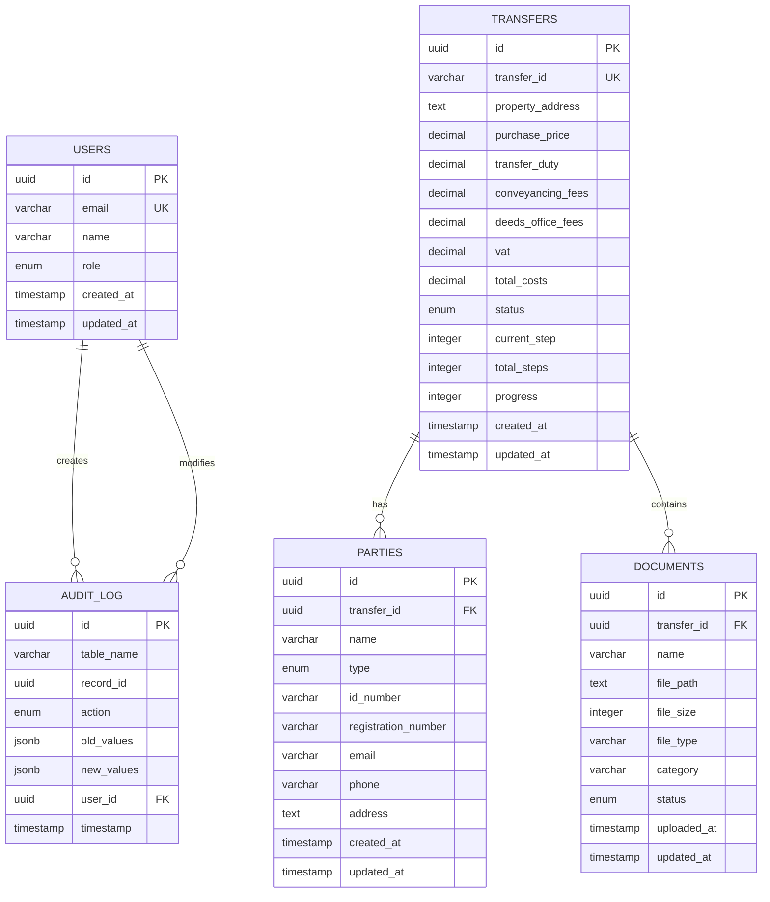

# Legitify ConveyHub - Mermaid ERD

## Entity Relationship Diagram (Mermaid)

## Relationship Types

### One-to-Many Relationships
- **USERS** to **AUDIT_LOG**: One user can create many audit entries
- **TRANSFERS** to **PARTIES**: One transfer can have many parties
- **TRANSFERS** to **DOCUMENTS**: One transfer can have many documents

### Cascade Delete Rules
- Deleting a TRANSFER deletes associated PARTIES and DOCUMENTS
- AUDIT_LOG entries are preserved for compliance

## Enum Values

### User Roles
- `admin` - System administrator
- `user` - Regular user
- `conveyancer` - Legal practitioner

### Transfer Status
- `draft` - Initial state
- `in_progress` - Active transfer
- `completed` - Finished transfer
- `cancelled` - Cancelled transfer

### Party Types
- `buyer` - Property purchaser
- `seller` - Property seller

### Document Status
- `pending` - Awaiting upload
- `uploaded` - File uploaded
- `verified` - Document verified
- `rejected` - Document rejected

### Audit Actions
- `INSERT` - Record creation
- `UPDATE` - Record modification
- `DELETE` - Record deletion

## Database Features

### Triggers
- Auto-update `updated_at` timestamps
- Calculate transfer progress on step change
- Audit logging for all modifications

### Views
- `transfer_summary` - Aggregated transfer data
- `party_details` - Party with transfer information
- `document_details` - Document with transfer context

### Indexes
- Performance optimization on foreign keys
- Search indexes on email, name, status
- Time-based indexes for reporting
