# DEEDLY Core Transfer / Matter Data Model

**Project:** P0 — Transfers Backend & Core Data Model
**Derived from:** `origin/main` @ `f5c6a338543ca43c5a7b227a82df30214d3e183e`
**Date:** 2026-09-16
**Status:** Documentation only. This is a model guide, not certification evidence. It
describes the schema and runtime validation *as implemented*; it does not redesign
anything, and it does not attest live database or upstream-service state.
**Companion artifact:** [`deedly-core-transfer-matter-data-model.svg`](./deedly-core-transfer-matter-data-model.svg)
— standalone, screen-reader-labelled rendering of the diagram in §4 for attaching
to Linear.

---

## 1. Purpose and scope

This guide explains the persisted model behind the DEEDLY transfer workflow:

- the **core spine**: `transfers.transfers`, `transfers.matters`,
  `transfers.transfer_parties`;
- **directly relevant supporting tables**: `properties`, `matter_properties`,
  `transfer_financials`, `transfer_documents`, `matter_milestones` /
  `milestone_definitions` / `milestone_history`, the specialist-context tables
  (`matter_estate_contexts`, `party_relationship_assignments`,
  `representative_assignments`), the reference/config tables
  (`matter_classification_options`, `entity_type_definitions`,
  `party_role_definitions`, `classification_party_role_rules`,
  `classification_milestone_map`, `classification_document_map`,
  `representative_capacity_definitions`, `party_relationship_definitions`), and
  the accounts/billing tables (`account_firm_settings`, `tariff_schedules`,
  `proforma_statements`);
- **external references** the schema deliberately does not FK: Golden Record ids,
  `accountable_institution_id`, and platform `*_user_id` values;
- **legacy tables still present** but quarantined/deprecated
  (`parties`, `matter_parties`, `golden_record_links`, `users`, `firms`, `audit_log`, …).

Out of scope: Golden Record search/retrieve transport, the SARS submission model
(migration 022 lives only on the unmerged
`deedly/mvp1/sars-integration/tdc01-foundation` branch — see §3), generated-document
internals, and the documents/clauses catalogue internals beyond what
`transfer_documents` and `classification_document_map` touch.

## 2. Conventions used in this guide

- **Enforced FK** — a real `FOREIGN KEY` constraint in the migration SQL.
- **Logical reference** — a stored value with **no** database FK: either a
  cross-database/platform identifier (Golden Record UUIDs, platform
  `accountable_institution_id`, platform `*_user_id`) or a deliberate design gap
  (`matters.source_record_id`, `proforma_statements.transfer_id`,
  `transfer_parties.role`, `properties.created_for_transfer_id`).
- **Source** column values in the field reference:
  - *user* — supplied in the API request;
  - *system* — generated or set by server code/DB defaults;
  - *derived-tenant* — derived from the verified caller's institution or from a
    parent row via trigger, never accepted from the request;
  - *derived-GR* — taken from the verified Golden Record fetch, not the request.
- **Required** reflects the DB constraint first; where runtime validation is
  stricter than the schema it is noted explicitly (see also §11).

## 3. Schema layout and migration sequence

Two PostgreSQL schemas matter:

- **`transfers`** — DEEDLY-owned working data. The FastAPI service and the Node
  BFF both connect with `search_path = transfers, public`
  (`python_server/config.py` `DB_SCHEMA`, `server/db.ts`). Migration 010 moved the
  approved working-data tables from `public` into `transfers`; everything created
  from migration 008 onward is created directly in `transfers` via
  `SET LOCAL search_path`. Note the deliberate name overlap: the *schema* is
  `transfers` and it contains a *table* also named `transfers`
  (`transfers.transfers`).
- **`public`** — platform-adjacent/legacy objects that were not moved: `users`,
  `firms`, `user_preferences`, `audit_log`, `activity_log`, `documents`,
  `document_catalogue`, `document_templates*`, `template_*`, `clauses*`,
  `generated_documents*`, `cancellations`, `bonds`, `fica_verifications`,
  `matter_parties`, `communications`, `golden_record_links`, `party_bank_accounts`.

Migrations live in `src/lib/migrations/` and are applied **in filename order** by
`scripts/migrate.mjs`, which records each file's SHA-256 in
`public.transfers_schema_migrations` and refuses to re-run a modified file.
There is no Alembic.

| # | File | Lands in this model |
|---|------|---------------------|
| 001 | `001_initial_schema.sql` | `users`, `transfers`, `parties`, `documents`, `audit_log`; `generate_transfer_id()`, `update_updated_at_column()`, progress trigger, SA-ID check function |
| 002 | `002_add_properties_table.sql` | `properties`, `transfers.property_id`, `generate_property_id()`, postal-code check |
| 003 | `003_complete_conveyhub_schema.sql` | `firms`, `matters`, `matter_parties`, `party_bank_accounts`, `transfer_financials`, `bonds`, `municipal_accounts`, `clearance_records`, `transfer_guarantees`, `transfer_conditions`, `compliance_certificates`, `fica_verifications`, `matter_accounts(+entries)`, `milestone_definitions`, `matter_milestones`, `milestone_history`, template/catalogue/clauses/documents extension tables, `generated_documents*`, `cancellations`, `refunds`, `communications`, `activity_log`, `golden_record_links`; `transfers.matter_id` + financial columns; `parties.matter_id` etc.; converts `matter_milestones.due_date/completed_date` to `TIMESTAMPTZ` |
| 004 | `004_seed_reference_data.sql` | Seeds `template_data_fields`, 23 `milestone_definitions`, `document_catalogue`, `clauses`/`clause_versions` |
| 005 | `005_transfer_documents.sql` | `transfer_documents` |
| 006 | `006_update_property_types.sql` | `properties.property_type` CHECK → the 9 conveyancing values |
| 007 | `007_add_identification_document.sql` | Seeds `document_catalogue` row `CAT-021` |
| 008 | `008_create_transfer_parties.sql` | `transfer_parties` (created directly in `transfers` schema) |
| 009 | `009_add_accountable_institution_id_to_matters_and_transfers.sql` | `accountable_institution_id` (nullable) on `matters`, `transfers` |
| 010 | `010_move_transfer_owned_tables_to_transfers_schema.sql` | Moves 17 working-data tables to `transfers`; drops legacy views |
| 011 | `011_add_property_created_for_transfer_id.sql` | `properties.created_for_transfer_id` scaffold provenance |
| 012 | `012_backfill_qa_tenant_and_enforce_ownership.sql` | Backfills QA tenant `accountable_institution_id = 5` onto the prototype 8+8 rows and sets the columns `NOT NULL` (guarded; no-op on a fresh DB) |
| 013 | `013_add_platform_user_actor_columns.sql` | Parallel platform `*_user_id INTEGER` actor columns (no FK) |
| 014 | `014_rename_transfers_submitted_by_user_id_to_created_by_user_id.sql` | Renames `transfers.submitted_by_user_id` → `created_by_user_id`; legacy UUID `submitted_by` untouched |
| 015 | `015_deedly_classification_taxonomy.sql` | `matter_classification_options` + seed, `matters.classification_code` + `firm_reference`, `classification_milestone_map`, `classification_document_map` |
| 016 | `016_deedly_status_lifecycle.sql` | Two-state status: `transfers.status ∈ {in_progress, complete}`; `matters.status` restricted to the same pair **only when `matter_type='transfer'`** |
| 017 | `017_create_accounts_billing_config.sql` | `account_firm_settings`, `tariff_schedules`, `proforma_statements` |
| 018 | `018_deedly_party_property_contract_foundation.sql` | `entity_type_definitions`, `party_role_definitions`, `classification_party_role_rules` + seeds; `transfer_parties.is_primary_contact` + partial-unique; `entity_type` widened to `VARCHAR(40)` with FK to `entity_type_definitions`; `matter_properties` + tenant trigger |
| 019 | `019_deedly_property_tenant_isolation.sql` | `properties.accountable_institution_id NOT NULL`; composite tenant FKs on `matter_properties`/`transfers`/`matters` → `properties(id, accountable_institution_id)`; backfills `transfers.property_id` → `matter_properties`; one-way legacy→`matter_properties` sync trigger |
| 020 | `020_deedly_taxonomy_approved_classifications.sql` | Adds `transfer.deceased_estate_sale`, `transfer.endorsement_section_45bis` taxonomy rows (no role rules) |
| 021 | `021_deedly_specialist_role_capacity_persistence.sql` | `representative_capacity_definitions` (seeded), `party_relationship_definitions` (**unseeded**), `matter_estate_contexts`, `party_relationship_assignments`, `representative_assignments`; tenant-anchoring triggers; composite unique keys on `transfers`/`transfer_parties` to serve as tenant-safe FK targets |
| — | **022 — gap on main** | `022_deedly_sars_tdc01_foundation.sql` exists only on the unmerged branch `deedly/mvp1/sars-integration/tdc01-foundation` (commit `120a075`); the number is effectively reserved. A fresh `main` migration should not reuse `022` without coordinating with that branch |
| 023 | `023_deedly_manual_party_sources.sql` | `transfer_parties`: `party_source` discriminator, `manual_*` capture fields, source-shape CHECK, drops `golden_record_id NOT NULL`; `client_request_id` + `request_fingerprint` on `transfer_parties` **and** `transfers` with institution-scoped partial-unique indexes; `acknowledged_duplicate` |

## 4. High-level entity-relationship diagram

Solid edges are **enforced foreign keys**; dashed edges are **logical/external
references with no DB constraint**. Cardinalities reflect the constraints, not
aspirations (e.g. `transfers.matter_id` is nullable, so a transfer *may* exist
without a matter even though both create paths always make one).

```mermaid
erDiagram
    %% ===== Core spine (transfers schema) =====
    MATTERS ||--o| TRANSFERS : "transfers.matter_id FK SET NULL; matters.source_record_id = transfers.id::text (logical, verified)"
    TRANSFERS ||--o{ TRANSFER_PARTIES : "FK transfer_id CASCADE"
    TRANSFERS ||--o| TRANSFER_FINANCIALS : "PK/FK transfer_id CASCADE"
    TRANSFERS ||--o{ TRANSFER_DOCUMENTS : "FK transfer_id CASCADE"
    TRANSFERS }o--o| PROPERTIES : "legacy composite FK (property_id, ai) SET NULL — enforced"

    MATTERS ||--o{ MATTER_PROPERTIES : "FK matter_id CASCADE"
    MATTER_PROPERTIES }o--o| PROPERTIES : "composite FK (property_id, ai) CASCADE"
    MATTERS ||--o{ MATTER_MILESTONES : "FK matter_id CASCADE"
    MILESTONE_DEFINITIONS ||--o{ MATTER_MILESTONES : "FK definition_id SET NULL"
    MATTER_MILESTONES ||--o{ MILESTONE_HISTORY : "FK milestone_id CASCADE"

    %% ===== Specialist / estate slice =====
    TRANSFERS ||--o{ MATTER_ESTATE_CONTEXTS : "composite FK (transfer_id, ai) CASCADE"
    TRANSFERS ||--o{ REPRESENTATIVE_ASSIGNMENTS : "composite FK (transfer_id, ai) CASCADE"
    TRANSFER_PARTIES ||--o{ PARTY_RELATIONSHIP_ASSIGNMENTS : "composite FK (transfer_party_id, ai) CASCADE"
    REPRESENTATIVE_ASSIGNMENTS }o--o| TRANSFER_PARTIES : "3-col FK (represented_transfer_party_id, transfer_id, ai) — XOR target"
    REPRESENTATIVE_ASSIGNMENTS }o--o| MATTER_ESTATE_CONTEXTS : "3-col FK (represented_estate_context_id, transfer_id, ai) — XOR target"

    %% ===== Reference / config data =====
    MATTER_CLASSIFICATION_OPTIONS ||--o{ MATTERS : "FK classification_code UPDATE CASCADE"
    MATTER_CLASSIFICATION_OPTIONS ||--o{ CLASSIFICATION_PARTY_ROLE_RULES : "FK CASCADE"
    PARTY_ROLE_DEFINITIONS ||--o{ CLASSIFICATION_PARTY_ROLE_RULES : "FK CASCADE"
    ENTITY_TYPE_DEFINITIONS ||--o{ TRANSFER_PARTIES : "FK entity_type RESTRICT"
    REPRESENTATIVE_CAPACITY_DEFINITIONS ||--o{ REPRESENTATIVE_ASSIGNMENTS : "FK capacity RESTRICT"
    PARTY_RELATIONSHIP_DEFINITIONS ||--o{ PARTY_RELATIONSHIP_ASSIGNMENTS : "FK relationship_code RESTRICT (table unseeded)"
    PARTY_ROLE_DEFINITIONS }o..o{ TRANSFER_PARTIES : "role: NO FK — runtime-validated (transferor|transferee)"
    MATTER_CLASSIFICATION_OPTIONS ||--o{ CLASSIFICATION_MILESTONE_MAP : "FK CASCADE"
    MILESTONE_DEFINITIONS ||--o{ CLASSIFICATION_MILESTONE_MAP : "FK CASCADE"
    MATTER_CLASSIFICATION_OPTIONS ||--o{ CLASSIFICATION_DOCUMENT_MAP : "FK CASCADE"
    DOCUMENT_CATALOGUE ||--o{ CLASSIFICATION_DOCUMENT_MAP : "FK CASCADE (public schema)"
    DOCUMENT_CATALOGUE ||--o{ TRANSFER_DOCUMENTS : "FK catalogue_document_id SET NULL (cross-schema)"

    %% ===== Accounts / billing =====
    TRANSFERS ||..o{ PROFORMA_STATEMENTS : "transfer_id logical — NO FK"
    ACCOUNT_FIRM_SETTINGS }o..o| TARIFF_SCHEDULES : "active_tariff_schedule_id logical — NO FK"

    %% ===== External / platform (cross-database: never FK) =====
    TRANSFER_PARTIES }o..o| LEGITIFY_GOLDEN_RECORD : "golden_record_id (NULL for manual parties)"
    MATTER_ESTATE_CONTEXTS }o..o| LEGITIFY_GOLDEN_RECORD : "deceased_golden_record_id"
    REPRESENTATIVE_ASSIGNMENTS }o..o| LEGITIFY_GOLDEN_RECORD : "person_golden_record_id"
    TRANSFERS }o..|| PLATFORM_INSTITUTION : "accountable_institution_id INTEGER (all core tables)"
    TRANSFERS }o..o| PLATFORM_USER : "created_by_user_id INTEGER (JWT user_id)"

    %% ===== Deprecated but present =====
    MATTERS }o--o| PUBLIC_FIRMS : "firm_id FK RESTRICT — enforced but deprecated"
    TRANSFERS ||--o{ PUBLIC_PARTIES : "FK transfer_id CASCADE — legacy party table (buyer/seller)"
    PUBLIC_PARTIES }o--o{ MATTERS : "via public.matter_parties — enforced but deprecated"

    MATTERS {
        uuid id PK
        varchar reference_number "UNIQUE(firm_id, reference_number) — see §11"
        varchar matter_type "transfer|bond|cancellation|general"
        varchar status "transfer matters: in_progress|complete"
        varchar source_record_id "holds transfers.id::text — no UNIQUE"
        uuid matter_id_target "transfers.matter_id points back here"
        varchar classification_code FK
        varchar firm_reference
        int accountable_institution_id "NOT NULL, external"
    }
    TRANSFERS {
        uuid id PK
        varchar transfer_id UK "TRF-YYYY-… user-facing"
        uuid matter_id FK
        uuid property_id "legacy pointer"
        text property_address
        decimal purchase_price
        varchar status "in_progress|complete"
        int accountable_institution_id "NOT NULL, external"
        int created_by_user_id "platform user id, no FK"
        uuid client_request_id "idempotency key"
        varchar request_fingerprint "sha256 of payload"
    }
    TRANSFER_PARTIES {
        uuid id PK
        uuid transfer_id FK
        uuid golden_record_id "NULL when manual"
        varchar entity_type FK "person|company|trust"
        varchar role "no DB check; runtime = transferor|transferee"
        varchar party_source "golden_record|manual"
        varchar manual_name "required iff manual"
        int accountable_institution_id "derived from parent transfer"
        boolean is_primary_contact
        uuid client_request_id
    }
    MATTER_PROPERTIES {
        uuid id PK
        uuid matter_id FK
        uuid property_id "composite FK half"
        varchar property_kind "input|output"
        int accountable_institution_id "trigger-derived from matters"
    }
    MATTER_ESTATE_CONTEXTS {
        uuid id PK
        uuid transfer_id "composite FK half"
        uuid deceased_golden_record_id "external"
        text masters_estate_reference "runtime-validated only"
    }
    REPRESENTATIVE_ASSIGNMENTS {
        uuid id PK
        uuid transfer_id "composite FK half"
        uuid person_golden_record_id "external"
        varchar capacity FK
        uuid represented_transfer_party_id "XOR"
        uuid represented_estate_context_id "XOR"
        varchar assignment_state "active|withdrawn|superseded"
    }
    PARTY_RELATIONSHIP_ASSIGNMENTS {
        uuid id PK
        uuid transfer_party_id "composite FK half"
        varchar relationship_code FK "reference table unseeded"
    }
```

The same content, laid out for review without a Mermaid renderer, is in
[`deedly-core-transfer-matter-data-model.svg`](./deedly-core-transfer-matter-data-model.svg).

## 5. Why `transfers` and `matters` both exist

They model two different things that happen to be created together:

- **`transfers.transfers`** is the *transaction record*: the user-facing
  `TRF-…` reference, the property address and purchase price, the two-state
  lifecycle (`in_progress`/`complete`), the owning institution, the creator, and
  the idempotency key. Everything a list screen or a receipt needs.
- **`transfers.matters`** is the *workflow container*: `matter_type`
  (`transfer` here, but the table also supports `bond`, `cancellation`,
  `general`), the classification that drives document/milestone rules
  (`classification_code`), the firm-facing `firm_reference`, and it is the parent
  of `matter_milestones`, `matter_properties`, clearance/account/compliance rows.

Responsibility split in practice:

| Concern | Owner |
|---|---|
| User-facing reference (`TRF-…`), price, address, lifecycle status | `transfers` |
| Workflow identity, classification, milestone/document scaffolding | `matters` |
| Tenant ownership | **both** carry `accountable_institution_id` and must agree (enforced by construction: both are written in the same transaction from the same resolved value) |
| Party links | `transfer_parties` → `transfers` (not `matters`) |
| Property relationships (multi, input/output) | `matter_properties` → `matters` (canonical); `transfers.property_id` is legacy |
| Estate/trust specialist context | `matter_estate_contexts`, `representative_assignments` → `transfers` |

The link is deliberately redundant: `transfers.matter_id` (nullable FK, set at
create) **and** `matters.source_record_id = transfers.id::text` (varchar, no
constraint). Runtime reads key on `source_record_id` — the v1 milestones query and
the legacy delete path both use it — because the migrated prototype dataset has
`matter_id` NULL and `source_record_id` has no UNIQUE constraint (callers add
`accountable_institution_id` as defence in depth). A future cleanup could promote
one link and drop the other; today both must be maintained, and both create paths
set both.

## 6. Identifiers: internal vs user-facing vs external

Three distinct identifier families coexist and must not be conflated:

| Kind | Columns | Notes |
|------|---------|-------|
| Internal surrogate PKs | `id UUID` on every core table | Never shown to users; all intra-DB FKs use these |
| User-facing business keys | `transfers.transfer_id` (`TRF-YYYY-<epoch-tail>-<rand3>`), `properties.property_id` (`PROP-YYYY-<rand4>`), `matters.reference_number`, `matters.firm_reference` | `transfer_id` is generated by the DB function `generate_transfer_id()` on the v1 path and doubles as the matter's `reference_number`; `firm_reference` is the firm's own free-text reference |
| External platform/GR ids | `accountable_institution_id INTEGER`, `*_user_id INTEGER` (JWT `user_id` claim), `golden_record_id UUID`, `deceased_golden_record_id`, `person_golden_record_id` | **No FKs by design** — these are cross-database references into the Legitify platform/Golden Record stores. Asserted by service code and composite tenant FKs, not by referential integrity |

Watch the trap in `properties.created_for_transfer_id` (`VARCHAR(50)`): it stores
the **business** `transfer_id` string (`TRF-…`), not the UUID — a logical
provenance marker used only by the quarantined legacy delete path to decide
whether an auto-scaffolded property may be removed.

## 7. Institution ownership and isolation

`accountable_institution_id` (INTEGER, NOT NULL, no FK) is the tenant key on
`transfers`, `matters`, `properties`, `transfer_parties`, `matter_properties`,
`matter_estate_contexts`, `party_relationship_assignments`,
`representative_assignments`, and the accounts tables.

- **Write path:** the FastAPI v1 service resolves it from the *verified JWT
  claim* via `resolve_write_tenant_id`; a body-supplied value must equal the
  caller's institution or the request is denied — no privileged-role exception
  (`python_server/auth/policy.py`). Child writes (`transfer_parties`, estate
  contexts, assignments) derive the tenant from the parent transfer row, never
  from the request, and re-check it inside the write transaction.
- **Schema enforcement:** `BEFORE INSERT OR UPDATE` triggers overwrite the
  tenant column on `matter_properties` (from `matters`), `matter_estate_contexts`
  and `representative_assignments` (from `transfers`), and
  `party_relationship_assignments` (from `transfer_parties`). Composite FKs like
  `(transfer_id, accountable_institution_id) → transfers(id,
  accountable_institution_id)` make a child row that disagrees with its parent's
  tenant unwritable — that is why migration 021 adds
  `(id, accountable_institution_id)` / `(id, transfer_id,
  accountable_institution_id)` unique indexes: they exist to be FK *targets*.
  `transfer_parties` is the exception that proves the rule: its
  `accountable_institution_id` is application-derived (service re-checks the
  parent inside the transaction) — it has the unique indexes to be a *target*,
  but no composite FK forces it to equal the parent's tenant.
- **Read path:** every v1 query predicates on `accountable_institution_id` from
  the verified claim. Clients (`user_roles_id = 4`) get a stricter rule: a
  transfer is visible only if their `golden_record_id` appears in its
  `transfer_parties` rows, and the party projection they receive is a minimal
  subset of their own row only.
- **Known soft spots** (details in §11): `transfer_financials` and
  `transfer_documents` carry **no** `accountable_institution_id` — they are
  tenant-safe only because every read goes through an already-authorised parent
  transfer (the code comments say explicitly not to add the column in those
  steps). `matters.firm_id`→`public.firms` is the deprecated pre-DEEDLY owner
  model and stays NULL on DEEDLY rows.

## 8. Manual vs Golden Record parties

`transfer_parties.party_source` (`golden_record` | `manual`, CHECK-enforced) is
the discriminator added by migration 023; a row is exactly one shape.

**Golden Record parties** (`party_source = 'golden_record'`):

- Required: `golden_record_id` (UUID), `entity_type`, `role`.
- Before insert the service runs the mandated visibility recipe
  (`services/golden_record_visibility.py`): users-service linkage check
  ("is this GR a client of this AI") **then** the typed Entities fetch — trust
  retrieves as `company` + `is_trust` — with **no DB transaction open**; only
  then a short transaction re-checks the parent and inserts.
- Only `golden_record_id` plus the approved display cache
  (`cached_name`, `cached_id_number`, `cached_email`, `synced_at`) is persisted —
  the minimality rule of the S2S guide; nothing else from the fetched record may
  be stored.
- Uniqueness: `(transfer_id, golden_record_id, role)` — the same GR may hold
  several roles; the same GR+role may not repeat on one transfer.

**Manual parties** (`party_source = 'manual'`):

- Firm-private capture: `manual_name` (required, non-blank), optional
  `manual_id_number`, `manual_id_type` (`sa_id`/`passport`/`other`),
  `manual_passport_country` (allowed only when `id_type='passport'`),
  `manual_email`, `manual_phone`, `manual_address`.
- `entity_type` must be `'person'` (DB CHECK + service check) and
  `golden_record_id` must be NULL (CHECK `transfer_parties_source_fields_check`
  forbids mixing shapes).
- No upstream call, no verification implied, and **no dedup constraint** — with
  `golden_record_id` NULL the `(transfer_id, golden_record_id, role)` unique key
  never fires for manual rows (Postgres NULLs are distinct); distinct manual
  identities are always distinct rows.
- Duplicates are advisory only: `findPotentialDuplicates`
  (`src/lib/utils/partyDuplicates.ts`) compares like-typed identifiers
  (SA ID never matches a passport; passport country must agree when both carry
  one) and normalized names, and `acknowledged_duplicate` records that a warned
  duplicate was accepted. `manual_id_type`/`manual_passport_country` exist
  solely to keep that comparison like-for-like.

`role` and `entity_type` are explicit for **both** sources. `is_primary_contact`
is a communication/UI flag only — at most one per `(transfer_id, role)` via a
partial unique index — and confers no legal authority.

## 9. Idempotency keys and partial-save recovery

**Request idempotency** (migration 023): `client_request_id` (UUID) +
`request_fingerprint` (SHA-256 hex of the validated payload) on both `transfers`
(matter create) and `transfer_parties` (party attach). Each has a partial unique
index on `(accountable_institution_id, client_request_id) WHERE
client_request_id IS NOT NULL`, so:

- a retry with the same key *and* same payload returns the existing row
  (create responds 200 + `created:false` instead of 201);
- the same key with a *different* payload → 409 idempotency conflict;
- a foreign institution reusing the same UUID can neither observe nor collide —
  the key is scoped per institution by design.
- Party attach additionally loses gracefully on unique races: `ON CONFLICT
  (transfer_id, golden_record_id, role) DO NOTHING` then re-select, and a lost
  race without a `client_request_id` surfaces as a generic 409 party conflict.

**Partial-save recovery** is mostly *create-transaction atomicity*:

- v1 `POST /api/v1/transfers` inserts `transfers` + `matters` in one short
  transaction — no half-created matter. If the response is lost after commit,
  retrying with the same `client_request_id` recovers the row instead of
  duplicating it. **However**, v1 create currently persists only the transfer
  row, the matter row, and (optionally) classification/firm_reference — it does
  **not** create `properties`/`matter_properties`, `transfer_financials`,
  `matter_milestones` or `transfer_documents` rows. That scaffolding exists only
  on the legacy create path, which is quarantined (503) on both servers, so a v1
  transfer today is intentionally sparse — the deferred authenticated-matter-
  saving work in §12 fills this in.
- The quarantined legacy create (`POST /api/transfers`) did the same thing in
  one larger transaction — property scaffold, transfer, financials, parties
  (legacy `parties` table), matter, default milestones, seeded
  `transfer_documents`.
- Legacy delete (also quarantined) encoded the recovery rules the model still
  encodes: delete the transfer; delete its matter only when exactly one
  `source_record_id` match exists and no other transfer/child rows block it;
  delete the auto-scaffolded property only when
  `created_for_transfer_id` equals this transfer's business id and nothing else
  references it — ambiguous duplicates are retained rather than guessed.

## 10. Core-field reference

Required = enforced at the DB level; *runtime-stricter* cases are marked.

### 10.1 `transfers.transfers` — the transaction record

| Field | Type | Req | Source | Purpose / rules |
|---|---|---|---|---|
| `id` | uuid | PK | system (`uuid_generate_v4`) | Internal surrogate key; target of all transfer FKs |
| `transfer_id` | varchar(50) | req, UNIQUE | system (`generate_transfer_id()` on v1) | User-facing `TRF-YYYY-…` reference; also copied into `matters.reference_number` |
| `property_address` | text | req | user | Display address; v1 requires non-empty string |
| `purchase_price` | decimal(12,2) | req | user | v1: number, finite, ≥ 0 |
| `status` | varchar(50) | req | system `'in_progress'` | CHECK `in {in_progress, complete}` (016). ⚠ column **default still `'draft'`** — see §11 |
| `current_step` / `total_steps` / `progress` | int | req | system 1/5/0 | Legacy wizard fields; `progress` recomputed by `update_transfer_progress` trigger on `current_step` changes |
| `matter_id` | uuid | opt | system | FK → `matters(id)` ON DELETE SET NULL; back-pointer set by both create paths (dual of `source_record_id`) |
| `property_id` | uuid | opt | system (legacy only) | Legacy single-property pointer; composite FK `(property_id, accountable_institution_id) → properties` SET NULL (019); `matter_properties` is canonical — see §11 |
| `transfer_duty`, `conveyancing_fees`, `deeds_office_fees`, `vat`, `total_costs`, `deposit_amount`, `loan_amount`, `post_and_petties`, `clearance_certificate_fee`, `rates_clearance_amount`, `net_proceeds` | numeric | opt | user (legacy) | Parallel financial columns from 001/003; **v1 does not write them** — canonical financials live in `transfer_financials` |
| `interest_rate` | numeric(8,5) | opt | user (legacy) | — |
| `loan_term_years` | int | opt | user (legacy) | — |
| `transaction_date`, `occupation_date`, `registration_date` | date | opt | user (legacy) | Unused by v1 |
| `currency_code` | char(3) | req | system `'ZAR'` | — |
| `submitted_at` / `submitted_by` | timestamptz / uuid→`public.users` | opt | legacy | Unused by v1; `submitted_by` is a deprecated local-users FK |
| `accountable_institution_id` | int | req | derived-tenant | External platform institution id; no FK; NOT NULL since 012; composite-unique `(id, ai)` exists as an FK target |
| `created_by_user_id` | int | opt | derived (JWT `user_id`) | Platform actor id; no FK; renamed from `submitted_by_user_id` (014) |
| `client_request_id` | uuid | opt | user | Idempotency key; partial UNIQUE `(ai, client_request_id)` |
| `request_fingerprint` | varchar(64) | opt | system | SHA-256 of the validated payload; compared on key replay |
| `created_at` / `updated_at` | timestamptz | req | system | `updated_at` maintained by trigger |

v1 `POST /api/v1/transfers` accepts exactly: `property_address`,
`purchase_price` (required); `firm_reference`, `classification_code`,
`client_request_id`, `accountable_institution_id` (optional; AI must equal the
verified claim). Any other key → 422 (allow-list body validation).

### 10.2 `transfers.matters` — the workflow container

| Field | Type | Req | Source | Purpose / rules |
|---|---|---|---|---|
| `id` | uuid | PK | system | Internal key |
| `reference_number` | varchar(100) | req | system | Set to the transfer's `TRF-…` by both create paths. UNIQUE `(firm_id, reference_number)` — **ineffective for DEEDLY rows** (`firm_id` NULL ⇒ never collides); see §11 |
| `matter_type` | varchar(50) | req | system `'transfer'` | CHECK `transfer|bond|cancellation|general`; gates the status CHECK and classification CHECK |
| `title` | varchar(255) | opt | system | `"Transfer {transfer_id}"` |
| `description` | text | opt | user | Unused by v1 create |
| `status` | varchar(50) | req | system `'in_progress'` | Transfer matters: CHECK `in_progress|complete` (016); other types keep the 7-value legacy list. ⚠ column default `'draft'` unchanged — §11 |
| `priority` | varchar(20) | req | system `'medium'` | CHECK `low|medium|high|urgent`; unused by v1 |
| `source_record_id` | varchar(255) | opt | system | Holds `transfers.id::text` — **the verified transfer↔matter link** used by runtime reads; no UNIQUE, no FK |
| `source_system` | varchar(100) | opt | system | Import provenance |
| `firm_id` | uuid | opt | — | FK → `public.firms` RESTRICT; deprecated owner model, NULL on DEEDLY rows |
| `property_id` | uuid | opt | legacy | Composite tenant FK → `properties(id, ai)` SET NULL (019); `matter_properties` is canonical |
| `assigned_to` / `created_by` | uuid→`public.users` | opt | legacy | Deprecated local-user FKs |
| `assigned_to_user_id` / `created_by_user_id` | int | opt | derived (JWT) | Platform actor ids; no FK |
| `classification_code` | varchar(100) | opt | user | FK → `matter_classification_options(canonical_code)` UPDATE CASCADE; CHECK: only allowed when `matter_type='transfer'`; v1 requires the option be `category='transfer'`, selectable and active |
| `firm_reference` | varchar(100) | opt | user | Firm's own reference string |
| `opened_date` | date | req | system `CURRENT_DATE` | — |
| `due_date` / `completed_date` | date | opt | user/system | — |
| `metadata` | jsonb | req | system `'{}'` | Free-form extension point |
| `accountable_institution_id` | int | req | derived-tenant | NOT NULL since 012; external |
| `created_at` / `updated_at` | timestamptz | req | system | trigger-maintained |

### 10.3 `transfers.transfer_parties` — party on a transfer

| Field | Type | Req | Source | Purpose / rules |
|---|---|---|---|---|
| `id` | uuid | PK | system | Internal key |
| `transfer_id` | uuid | req | system | FK → `transfers(id)` CASCADE |
| `golden_record_id` | uuid | cond. | user → verified | **Required iff `party_source='golden_record'`, NULL iff `manual`** (CHECK). External Legitify id — no FK; visibility asserted by service before insert |
| `entity_type` | varchar(40) | req | user | FK → `entity_type_definitions(code)` UPDATE CASCADE / DELETE RESTRICT; runtime requires active code; `manual` ⇒ `'person'` (CHECK + service) |
| `role` | varchar(40) | req | user | **No DB constraint** — runtime requires an active `party_role_definitions` code *and* membership of `{transferor, transferee}` for v1 attach; see §11 |
| `party_source` | varchar(16) | req | user | CHECK `golden_record|manual`; default `golden_record` backfills pre-023 rows; immutable in practice (no update route) |
| `accountable_institution_id` | int | req | derived-tenant | Read from the parent transfer by the service, re-checked inside the write transaction; **no composite FK** to the parent (contrast `matter_properties`); `(id, ai)` and `(id, transfer_id, ai)` unique indexes exist as FK targets for specialist tables |
| `cached_name` / `cached_id_number` / `cached_email` | varchar | opt | derived-GR | Display-minimal cache from the verified fetch; forbidden on `manual` rows |
| `synced_at` | timestamptz | opt | derived-GR | Cache write time |
| `manual_name` | varchar(255) | cond. | user | Required non-blank iff `manual`; forbidden on `golden_record` rows |
| `manual_id_number` | varchar(100) | opt | user | Optional identifier; **no mandatory-identifier rule** by design |
| `manual_id_type` | varchar(16) | opt | user | `sa_id|passport|other` (CHECK) |
| `manual_passport_country` | varchar(3) | cond. | user | Only when `manual_id_type='passport'` (CHECK) |
| `manual_email` / `manual_phone` / `manual_address` | varchar/text | opt | user | Contact capture; forbidden on `golden_record` rows |
| `is_primary_contact` | boolean | req | user (default `false`) | Communication flag only; partial UNIQUE `(transfer_id, role) WHERE is_primary_contact` ⇒ ≤1 primary per role per transfer |
| `client_request_id` | uuid | opt | user | Idempotency key; partial UNIQUE `(ai, client_request_id)` |
| `request_fingerprint` | varchar(64) | opt | system | Replay-vs-conflict discriminator |
| `acknowledged_duplicate` | boolean | req | user (default `false`) | Records acceptance of an advisory duplicate warning |
| `created_at` / `updated_at` | timestamptz | req | system | trigger-maintained |

Uniqueness: `UNIQUE (transfer_id, golden_record_id, role)` (manual rows exempt in
practice — NULL `golden_record_id` never collides); plus the two partial indexes
above.

v1 `POST /api/v1/transfers/{id}/parties` accepts exactly: `party_source`,
`entity_type`, `role` (required); `golden_record_id`, `manual{…}`,
`is_primary_contact`, `client_request_id`, `acknowledged_duplicate` (optional,
source-gated).

### 10.4 `transfers.matter_properties` — matter↔property (canonical)

| Field | Type | Req | Source | Purpose / rules |
|---|---|---|---|---|
| `id` | uuid | PK | system | — |
| `matter_id` | uuid | req | system | FK → `matters(id)` CASCADE |
| `property_id` | uuid | cond. | system/user | Composite FK `(property_id, ai) → properties(id, ai)` CASCADE (019); **required unless `property_kind='output'`** (CHECK — a proposed output may have no registered property yet) |
| `property_kind` | varchar(20) | req | user/system | CHECK `input|output` |
| `registration_status` | varchar(20) | opt | future | Placeholder for the proposed `proposed→surveyed→sg_approved→registered` lifecycle — **no CHECK, not yet driven by any route** |
| `role_in_matter` | varchar(50) | opt | future | e.g. `parent`, `resulting_section` — not yet driven |
| `external_property_id` | text | opt | future | Neutral placeholder pending the property-registry contract decision |
| `property_source` | varchar(100) | opt | system | Written `'legacy_transfer_<uuid>'` by the 019 backfill/sync trigger |
| `accountable_institution_id` | int | req | derived-tenant | Overwritten by `trg_matter_properties_set_tenant` from the parent matter — cross-tenant links unwritable |
| `created_at` / `updated_at` | timestamptz | req | system | — |

`UNIQUE (matter_id, property_id, property_kind)`. Written today only by the 019
backfill and the one-way `transfers.property_id` → `matter_properties` sync
trigger (`trg_sync_matter_properties_from_transfer`); **no v1 route writes it
yet** (see §11).

### 10.5 `transfers.properties` — working property data (core fields)

| Field | Type | Req | Source | Purpose / rules |
|---|---|---|---|---|
| `id` | uuid | PK | system | — |
| `property_id` | varchar(50) | req, UNIQUE | system (`PROP-YYYY-XXXX`) | User-facing business key |
| `street_address` | text | req | user | — |
| `city`, `province` | varchar | req | user (legacy defaults `'Unknown'`) | — |
| `postal_code` | varchar(10) | opt | user | CHECK: 4 digits when present (`validate_sa_postal_code`) |
| `country` | varchar(50) | req | system `'South Africa'` | — |
| `property_type` | varchar(50) | req | user→normalized | CHECK: the 9 conveyancing values (006) |
| `erf_number`, `title_deed_number`, `survey_general_number`, `lot_number`, `portion_number`, `sectional_title_*`, `rates_number`, `municipal_valuation`, `extent_sqm`, `zoning`, `legal_description`, … | mixed | opt | user | Conveyancing descriptors; many are legacy-capture only |
| `created_for_transfer_id` | varchar(50) | opt | system | Scaffold provenance storing the **business** `TRF-…` key (not the UUID); used by the legacy delete path to decide cleanup; logical ref, no FK |
| `source_system` / `source_record_id` | varchar | opt | system | Import provenance |
| `accountable_institution_id` | int | req | derived-tenant | NOT NULL since 019; unique `(id, ai)` is the composite-FK target |
| `status` | varchar(50) | req | system `'active'` | CHECK `active|inactive|sold|under_offer|suspended` |

### 10.6 `transfers.transfer_financials` — per-transfer financials (1:0..1)

`transfer_id` is both PK and FK → `transfers(id)` CASCADE. Money columns are
`numeric(14,2)` with `>= 0` checks (`interest_rate`, `loan_term_years` nullable
with conditional checks); `effective_rate`, `loan_to_value_ratio`,
`calculation_version`, `calculation_details`, `calculated_at` are computed-side
fields; `currency_code` defaults `'ZAR'`. **No
`accountable_institution_id`** — tenant safety is by the authorised parent only
(the v1 financials route comment says explicitly not to add the column in that
step).

### 10.7 `transfers.transfer_documents` — required-document tracking

`id` PK; `transfer_id` → `transfers` CASCADE; `catalogue_document_id` →
`public.document_catalogue(id)` SET NULL (cross-schema FK); `name`;
`status` CHECK `pending|uploaded|verified|rejected|not_required`; `notes`;
`file_path`, `file_size`, `file_type`, `original_file_name` (local-file era
fields — the boundary audit marks binary storage as belonging to the files
service); `uploaded_by` (legacy users FK) / `uploaded_by_user_id` (platform int);
`uploaded_at`. `UNIQUE (transfer_id, catalogue_document_id)`. **No
`accountable_institution_id`** — same parent-anchored caveat as financials.

### 10.8 Milestones

- `milestone_definitions` — `code` UNIQUE, `name`, `default_status_label`,
  `matter_type`, `sequence_number`, `is_active`; 23 transfer definitions seeded
  by 004.
- `matter_milestones` — `matter_id` → `matters` CASCADE; `definition_id` →
  `milestone_definitions` SET NULL; denormalised `name`/`status_label`;
  `status` CHECK `not_started|in_progress|completed|overdue|not_required`;
  `UNIQUE (matter_id, sequence_number)`; `due_date`/`completed_date` are
  **timestamptz** (converted at the tail of 003); `assigned_to` (legacy FK) +
  `assigned_to_user_id` (platform int, indexed).
- `milestone_history` — `milestone_id` → `matter_milestones` CASCADE; old/new
  status/date/notes snapshots; `changed_by` (legacy) + `changed_by_user_id`.

No route currently writes milestones — the only writers were the quarantined
legacy routers, and v1 exposes read-only `GET /{id}/milestones`.

### 10.9 `transfers.matter_estate_contexts` — deceased-estate context (021)

`id` PK; `transfer_id` + `accountable_institution_id` composite FK →
`transfers(id, ai)` CASCADE; `deceased_golden_record_id` uuid — **external
logical ref**, resolved through the visibility recipe as a `person` before
insert; `masters_estate_reference` text — **runtime-only validation** (trim,
≤100 chars, `^[A-Za-z0-9][A-Za-z0-9/\-. ]*$`; no DB constraint); tenant
trigger-derived; `created_by_user_id`/`updated_by_user_id` platform ints.
Unique indexes `(id, ai)` and `(id, transfer_id, ai)` exist as FK targets.
A matter may have several contexts; no `transfer_parties` row is created for the
estate itself.

### 10.10 `transfers.representative_assignments` (021)

`id` PK; `transfer_id`+`ai` composite FK → `transfers`;
`person_golden_record_id` uuid NOT NULL — external, resolved as `person`;
`capacity` → `representative_capacity_definitions(code)` RESTRICT;
exactly one of `represented_transfer_party_id` / `represented_estate_context_id`
(CHECK `chk_representative_assignment_single_target`), each a 3-column tenant
composite FK into `transfer_parties` / `matter_estate_contexts`;
`assignment_state` CHECK `active|withdrawn|superseded`, default `active`, **never
accepted from callers**; partial unique indexes prevent duplicate
`(transfer, person-GR, capacity, target)` assignments per target type.
Runtime adds: capacity must be `executor`/`masters_representative` for an estate
target, `trustee` for a `transfer_parties` target whose `entity_type='trust'`.
No authority-basis, evidence, or effectiveness columns — those are deferred
(§12).

### 10.11 `transfers.party_relationship_assignments` (021)

`id` PK; `transfer_party_id`+`ai` composite FK → `transfer_parties(id, ai)`
CASCADE; `relationship_code` → `party_relationship_definitions(code)` RESTRICT;
`UNIQUE (transfer_party_id, relationship_code)`; tenant trigger-derived.
⚠ `party_relationship_definitions` is **created but unseeded on main**, so the
`POST …/relationships` route (implemented on both BFF and FastAPI) can only
return "Unknown or inactive relationship code" until reference data lands.

### 10.12 Reference / config tables

| Table | Key | Seeded on main | Used by |
|---|---|---|---|
| `matter_classification_options` | `canonical_code` PK | 19 rows: 12 transfer (6 private_treaty + 6 other incl. `deceased_estate_sale`, `endorsement_section_45bis` via 020), 4 development, `transfer.generic` (non-selectable fallback) | `matters.classification_code` FK; role-rule and workflow maps |
| `entity_type_definitions` | `code` PK | `person`, `company`, `trust` | `transfer_parties.entity_type` FK |
| `party_role_definitions` | `code` PK | `transferor`, `transferee` only | runtime validation of `transfer_parties.role` (no FK) |
| `classification_party_role_rules` | (`classification_code`, `role_code`) PK | transferor+transferee rules for the 9 sale classifications + `transfer.donation` (`min 1`, `max NULL`, primary-contact allowed, all 3 entity types) | **not consulted by any route yet** — see §11 |
| `classification_milestone_map` / `classification_document_map` | composite PKs | generic-fallback rows only | workflow scaffolding (not yet consumed by routes) |
| `representative_capacity_definitions` | `code` PK | `executor`, `masters_representative`, `trustee` | `representative_assignments.capacity` FK |
| `party_relationship_definitions` | `code` PK | **none** | `party_relationship_assignments.relationship_code` FK — blocks all writes until seeded |

### 10.13 Accounts / billing (017)

- `account_firm_settings` — PK is `accountable_institution_id` itself (one row
  per institution): firm display name, VAT flag/number/rate,
  `active_tariff_schedule_id` (logical ref, no FK), `tariff_multiplier`,
  `trust_account` jsonb, `customary_disbursements` jsonb.
- `tariff_schedules` — `schedule_id` uuid PK; `id` (varchar) +
  `accountable_institution_id` unique via `COALESCE(ai,0)` — `ai NULL` marks the
  global official schedules; `brackets` jsonb.
- `proforma_statements` — `id` varchar PK; `transfer_id` uuid **logical ref, no
  FK**; `accountable_institution_id`; `matter_reference`; `statement_data` jsonb
  snapshot.

### 10.14 Legacy tables still in the schema

Present and structurally intact but **not authoritative** for DEEDLY — the
routes that wrote them are quarantined (503) on both servers, and the
data-boundary audit marks most for deprecation: `public.parties` (buyer/seller
shape; also has `matter_id`, `entity_type`, `company_name`, etc.),
`public.matter_parties`, `public.golden_record_links`, `public.users`,
`public.firms`, `public.user_preferences`, `public.audit_log`,
`public.activity_log`, `public.documents` + `document_parties`,
`public.party_bank_accounts`, `public.fica_verifications`, `public.bonds`,
`public.cancellations`, `public.communications`, the `transfers`-schema
`matter_accounts(+entries)`, `clearance_records`, `transfer_guarantees`,
`transfer_conditions`, `compliance_certificates`, `municipal_accounts`,
`refunds`. The catalogue/template/clause cluster remains in `public` pending the
documents-service ownership decision.

## 11. Discrepancy register — where migrations and runtime/docs disagree

These are **findings for Jordan to assess**, not approved schema changes. Each
lists the supporting migration/runtime location and the affected behavior.

1. **`transfers.status` default `'draft'` is unreachable-but-invalid.**
   *Evidence:* `001_initial_schema.sql` declares `status VARCHAR(50) DEFAULT
   'draft'` with the old 4-value CHECK; `016_deedly_status_lifecycle.sql`
   rewrites values and narrows the CHECK to `in_progress|complete` but never
   alters the column default. `003` line ~78 does the same for `matters.status
   DEFAULT 'draft'` (7-value list; 016 restricts it to the two-state pair only
   when `matter_type='transfer'`).
   *Affected behavior:* any `INSERT` that omits `status` violates the CHECK.
   All live code paths write `'in_progress'` explicitly
   (`python_server/services/matter_service.py`), so the defect is latent —
   it would only bite direct-SQL or future writers.
2. **`matters` uniqueness is keyed on a nullable legacy column.**
   *Evidence:* `003` line ~89 `UNIQUE (firm_id, reference_number)`; DEEDLY rows
   always have `firm_id = NULL`, and Postgres treats NULLs as distinct so the
   constraint can never fire for them. `matter_service.py` sets
   `reference_number = transfers.transfer_id`.
   *Affected behavior:* two transfer matters could share a `reference_number`;
   practical uniqueness rests on `transfers.transfer_id` being UNIQUE, not on
   this constraint.
3. **`transfer_parties.role` has no DB constraint.**
   *Evidence:* `008_create_transfer_parties.sql` declares `role VARCHAR(40)`
   with no CHECK/FK; runtime validation lives in
   `python_server/routers/v1/transfers.py` (~line 933 `_ORDINARY_PARTY_ROLES`
   and ~1100 the active `party_role_definitions` lookup).
   `docs/deedly-party-role-contract-audit.md` explicitly defers a DB
   constraint.
   *Affected behavior:* only v1 attach validates role; any other writer can
   store arbitrary strings.
4. **`classification_party_role_rules` is seeded but not enforced.**
   *Evidence:* `018` creates and seeds the table; a repo-wide search finds the
   only code reference in `python_server/tests/test_db_test_utils.py`
   (teardown) — the attach route validates role against
   `party_role_definitions` + the ordinary-role allow-list only.
   *Affected behavior:* per-classification minimums, maximums, entity-type
   restrictions and primary-contact flags exist as data but gate nothing.
5. **`party_relationship_definitions` is unseeded.**
   *Evidence:* `021` creates the table with no `INSERT`; the POST
   `…/parties/{id}/relationships` exists on both servers
   (`server/routes/v1/transfers.ts` ~717,
   `python_server/routers/v1/transfers.py`) and validates codes against the
   empty table.
   *Affected behavior:* every relationship attach returns 400 "unknown or
   inactive relationship code" until reference data lands.
6. **`masters_estate_reference` is validated only in code.**
   *Evidence:* `021` line ~83 declares it bare `TEXT`;
   `python_server/services/matter_specialist_service.py` enforces trim,
   ≤100 chars and `^[A-Za-z0-9][A-Za-z0-9/\-. ]*$`.
   *Affected behavior:* the DB accepts values the route rejects — divergence
   only matters for non-API writers.
7. **Dual transfer↔matter link.**
   *Evidence:* `003` adds both `transfers.matter_id` (FK) and
   `matters.source_record_id`; `matter_service.py` writes both; the v1
   milestones query and the legacy delete path key on `source_record_id`;
   the migrated prototype rows have `matter_id` NULL and `source_record_id`
   has no UNIQUE.
   *Affected behavior:* a documented transition state — both links must be
   maintained by every writer, and readers must predicate on
   `source_record_id` + `accountable_institution_id` for prototype data.
8. **`transfers.property_id` vs `matter_properties`.**
   *Evidence:* `002` adds the legacy pointer; `018` creates
   `matter_properties`; `019` backfills, adds the one-way sync trigger
   (`trg_sync_matter_properties_from_transfer`) and declares
   `matter_properties` canonical for v1 in its header comments;
   `routers/v1/transfers.py` has no `matter_properties` writer.
   *Affected behavior:* a v1-created transfer currently has neither a
   `properties` row nor a `matter_properties` row — the canonical table is
   populated only via the legacy path (now quarantined) or the trigger.
   Tracked under the authenticated-matter-saving work in §12.
9. **`transfer_parties.accountable_institution_id` is app-derived, not
   FK-derived.**
   *Evidence:* `008` adds the column with no composite FK to the parent;
   `021` adds `(id, ai)` / `(id, transfer_id, ai)` unique indexes as FK
   *targets*; sibling children get anchoring triggers + composite FKs
   (`018`/`019`/`021`); `transfer_party_service.py` re-reads and re-checks
   the parent transfer's tenant inside the write transaction.
   *Affected behavior:* equivalent effect through a different mechanism —
   safe today, but a direct-SQL writer could create a tenant-divergent
   party row the schema would not reject.
10. **Contract-doc shape vs landed shape (021).**
    *Evidence:* `docs/deedly-specialist-role-capacity-contract.md` sketches
    `created_by_actor_id TEXT` and an `authority_basis` column; landed `021`
    uses `created_by_user_id`/`updated_by_user_id INTEGER` and no
    `authority_basis` (`matter_specialist_service.py` comments call the
    authority-basis concept out as intentionally deferred).
    *Affected behavior:* implementers reading the contract doc will look for
    columns/tables that do not exist; the doc needs a "landed vs deferred"
    annotation.
11. **Legacy vs platform actor duality.**
    *Evidence:* `001`/`003`/`005` create uuid `assigned_to`/`created_by`/
    `submitted_by`/`uploaded_by`/`changed_by` FKs into `public.users`;
    `013` adds parallel `*_user_id INTEGER` columns (no FK); `014` renames
    `transfers.submitted_by_user_id` → `created_by_user_id`.
    *Affected behavior:* live code writes only the int columns; the uuid FKs
    are stale/NULL on new rows and should not be trusted as actor sources.
12. **Stale companion docs.**
    *Evidence:* `docs/ERD.md`, `docs/ERD_Art.md`, `docs/ERD_Mermaid.md`,
    `docs/Database_Schema.md`, `README_Database.md` all predate the
    `transfers` schema, tenant columns, `transfer_parties` and the 016
    lifecycle; `python_server/utils/validate.py` still defines unused
    `VALID_STATUSES = [draft, in_progress, completed, cancelled]` (the v1
    router uses its own `TRANSFER_STATUSES`); `server/utils/validate.ts`
    mirrors the stale list.
    *Affected behavior:* anyone following those docs gets the pre-DEEDLY
    model; the dead validators are harmless but misleading.
13. **Migration numbering gap.**
    *Evidence:* `src/lib/migrations/` contains 001–021 and 023;
    `022_deedly_sars_tdc01_foundation.sql` exists only on
    `deedly/mvp1/sars-integration/tdc01-foundation` @ `120a075`.
    *Affected behavior:* `scripts/migrate.mjs` applies files in filename
    order, so a future main migration must not reuse `022` without
    coordinating with that branch or the ledger order will diverge.
14. **BFF/FastAPI write-surface split.**
    *Evidence:* `server/routes/v1/transfers.ts` proxies `POST /transfers`
    and `POST …/parties` to FastAPI (`DEEDLY_API_BASE_URL`), implements
    `POST …/relationships` locally (~717), and exposes only GETs for
    `…/estate-contexts` (~583) and `…/representative-assignments` (~801);
    `python_server/routers/v1/transfers.py` implements all of them.
    *Affected behavior:* browsers can create estate contexts and
    representative assignments only via the FastAPI surface; a BFF-only
    client cannot reach those POSTs.
15. **`parties.id_number` CHECK is format-only.**
    *Evidence:* `001` `validate_sa_id_number()` checks 13 digits (no Luhn/
    checksum); `002` `validate_sa_postal_code()` checks 4 digits.
    *Affected behavior:* well-formed-but-invalid values pass the DB; the
    legacy `parties` table is deprecated anyway, and manual-party
    `manual_id_number` is deliberately unconstrained — but the check names
    overstate their rigor.
16. **Client read projection is intentionally narrower than the table.**
    *Evidence:* `python_server/routers/v1/transfers.py` role-4 branch returns
    only the caller's own `transfer_parties` row with minimal fields;
    `AGENTS.md` documents the fail-closed stance pending a platform client
    contract.
    *Affected behavior:* client-role callers cannot see counterparties —
    intentional, not a table-projection bug; do not "fix" by widening.

## 12. Proposed / deferred / not-landed inventory

Things that exist in design docs or migrations but are **not** part of the live
model — do not code against them:

- **Specialist contract (§7.5/7.6 of `deedly-specialist-role-capacity-contract.md`):**
  `authority_bases` reference data, `authority_documents`,
  `authority_effectiveness`, `authority_basis` on `representative_assignments`,
  and any persisted `is_eligible_to_sign` / `is_required_signatory` /
  `is_actual_signatory` flags — all deferred; signing state is to be derived,
  not stored.
- **Unseeded reference data:** `party_relationship_definitions` (blocks
  `party_relationship_assignments` writes); specialist role/relationship codes
  (`heir`, `legatee`, `surviving_spouse`, `purchaser`, `beneficiary`) exist only
  in the contract doc; no `classification_party_role_rules` for development or
  the two 020 classifications.
- **`matter_properties` futures:** `registration_status` lifecycle values
  (`proposed`, `surveyed`, `sg_approved`, `registered`), `role_in_matter`
  vocabulary, and the `external_property_id`/`property_source` contract — columns
  exist, semantics deliberately unresolved.
- **`transfers.property_id` removal** — deferred until consumers migrate to
  `matter_properties` (019 contract note).
- **Authenticated matter saving — the remaining half of "durable matter
  attachment."** Party attachment itself is **implemented on main** (merged
  before this guide's source checkpoint): v1
  `POST /api/v1/transfers/{transfer_id}/parties` durably persists both Golden
  Record parties (with the verified display-minimal cache) and manual persons,
  with institution-scoped idempotent replay. What remains deferred is the
  broader authenticated save of the *rest* of the matter payload:
  `matter_properties` links and property scaffolding, `transfer_financials`,
  `matter_milestones`/`milestone_history`, `transfer_documents` rows, and any
  update/patch of existing transfer or matter fields — capabilities that
  existed only on the now-quarantined legacy `/api/transfers` routes
  (evidence: `routers/v1/transfers.py` exposes no such writers;
  `src/lib/api/transferApi.ts` still points the SPA's document/milestone calls
  at the quarantined endpoints). Until it lands, the only live write paths are
  `POST /api/v1/transfers` (transfer+matter pair) and the party attach above.
- **SARS model (022)** — six `sars_*` tables exist only on the unmerged
  `tdc01-foundation` branch.
- **Client-facing read contract** — what a role-4 caller may see beyond their
  own minimal party row is undocumented upstream; the code fails closed.
- **Platform-owned pieces intentionally absent here:** a local `users` table
  replacement decision, `files`-service document binaries, `legitify_auditor`
  audit writing, EventBus emission — all flagged in the boundary audit as
  target-state items not yet executed.

## 13. Source commit and provenance

- Inspected commit: `origin/main` = `f5c6a338543ca43c5a7b227a82df30214d3e183e`
  (merge of `deedly/mvp0/auth/production-authentication`).
- Migration sequence inspected: `001`–`021`, `023` in
  `src/lib/migrations/` (applied in filename order by `scripts/migrate.mjs`;
  ledger `public.transfers_schema_migrations`).
- Runtime inspected: `python_server/routers/v1/transfers.py`,
  `python_server/services/{matter_service,transfer_party_service,
  matter_specialist_service,golden_record_visibility}.py`,
  `python_server/repositories/{transfer_parties,matter_specialist_contexts}.py`,
  `python_server/auth/{policy,current_user,dependencies}.py`,
  `python_server/routers/transfers.py` (quarantined legacy),
  `server/routes/v1/transfers.ts`, `server/routes/transfers.ts` (quarantined),
  `src/lib/utils/partyDuplicates.ts`.
- Design docs cross-referenced for the deferred inventory:
  `docs/deedly-party-role-contract-audit.md`,
  `docs/deedly-specialist-role-capacity-contract.md`,
  `docs/deedly-data-boundary-audit.md`.
- No live database was queried and no migrations were run for this guide; every
  claim traces to the migration SQL or the runtime source listed above.
